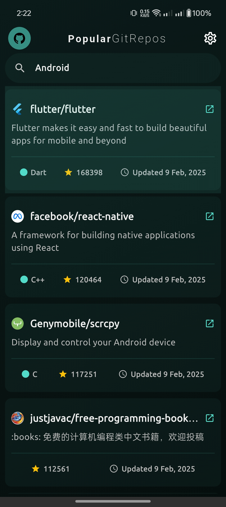
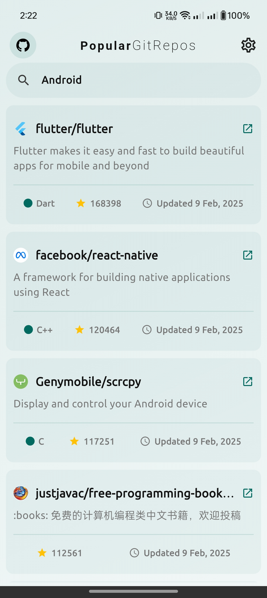
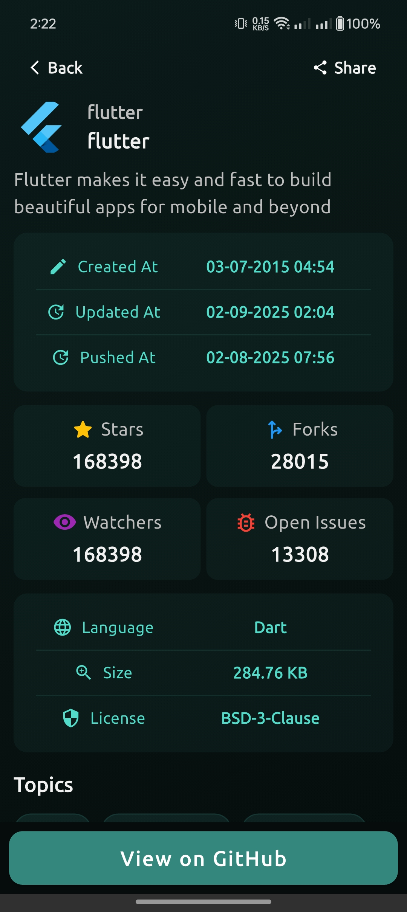

# Popular GitRepos

A Flutter-based Android application that displays the most starred GitHub repositories related to "Android." This project is designed to be scalable, maintainable, and follows best practices in software development.

[](https://github.com/theprantadutta/popular-gitrepos/releases/download/v1.0.0/popular_gitrepos.apk)

## Screenshots

<p align="center">
  
  
</p>

<p align="center">
  
  
</p>

## Features

- Fetches the most starred repositories from GitHub API using "Android" as the search keyword.
- Stores fetched data in a local database for offline support.
- Displays the list of repositories on the home page.
- Navigates to a detailed view of a repository when clicked.
- Shows repository details, including:
  - Repository owner's name and profile picture.
  - Repository description.
  - Last update date in `MM-DD-YYYY HH:SS` format along with creation and last pushed date.
  - Additional useful repository details.
  - Ability to share a github repository url along with view in github features.

## Tech Stack

- **Flutter** (for cross-platform development)
- **Dart** (primary programming language)
- **GitHub API** (for fetching repository data)
- **Drift** (for local storage)
- **Dio** (for API calls)
- **Riverpod** (for state management)

## Project Structure

The project follows the following structures:

- `lib/constants/` - Contains constants like colors, keys, selector strings etc.
- `lib/screens/` - Contains screens for this app
- `lib/services/` - Handles API communication and database storage.
- `lib/components/` - Reusable UI components.
- `lib/providers` - Contains Riverpod states
- `lib/entities` - Local Database Entities
- `lib/navigation` - Contains Navigation Logic like router, layouts etc.

## Installation

1. Clone the repository:
   ```sh
   git clone https://github.com/theprantadutta/popular-gitrepos.git
   cd popular-gitrepos
   ```
2. Install dependencies:
   ```sh
   flutter pub get
   ```
3. Run the app:
   ```sh
   flutter run
   ```

## API Reference

The app fetches data from the [GitHub Search API](https://docs.github.com/en/rest/search#search-repositories).

Example API call:
```sh
GET https://api.github.com/search/repositories?q=Android&sort=stars&order=desc
```

## Development Guidelines

- Follow a proper architecture from start to finish.
- Use Dependency Injection for better maintainability.
- Ensure code quality with linting and proper formatting.
- Maintain meaningful commit messages and version control best practices.

## Contribution

Feel free to fork the repository and submit pull requests. Suggestions and improvements are welcome!

## License

MIT License. See `LICENSE` for details.
